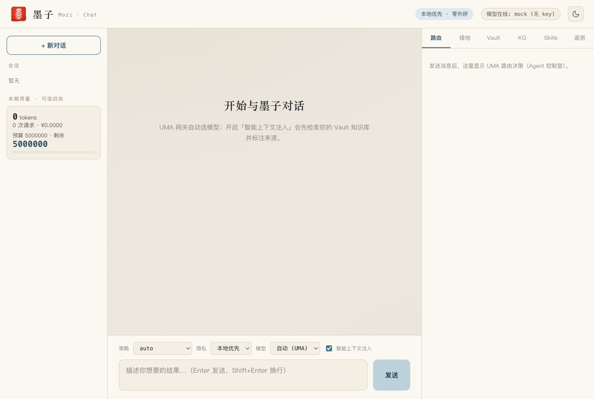

<div align="center">

<h1>&nbsp; 墨子 · Mozi</h1>

**本地优先的桌面 AI 平台** — 一座网关统一多模型路由，一座 Vault 沉淀你的知识，全程零 key、零外呼即可端到端运行。

*A local-first desktop AI platform: a unified multi-model routing gateway plus a personal knowledge Vault & KG — runnable end-to-end with zero API keys and zero network egress.*

[](LICENSE)


</div>

<div align="center"><b>中文</b> · <a href="README.en.md">English</a></div>

墨子·Chat（前端）+ UMA 多模型路由网关 + Vault & Mozi-KG（后端）+ SQLite。核心闭环：**对话 — 路由 — 知识**。缺 key 自动走本地 mock，零外呼即可端到端跑通；配置任一模型 key 即切真实流式。Tauri/Rust 原生外壳为打包项，当前以 **Python（FastAPI）后端 + React/TS 前端 + SQLite** 实现全部接口契约与数据模型。



---

## 特性

- **UMA 多模型路由网关** — `/v1/chat` OpenAI 兼容 SSE；6 策略 + 成本感知 + 隐私级（信创只选国产）+ 任务识别 + 降级链。
- **国产优先的适配层** — mock（零 key）+ GLM / DeepSeek / Kimi / MiniMax / 火山方舟（OpenAI 兼容）+ Claude（Anthropic）+ GPT。火山方舟托管 DeepSeek-V4-Pro（1M 上下文）与豆包 Seed 推理模型。
- **推理通道** — 推理模型（豆包 Seed / DeepSeek）思维链经独立 `reasoning` 事件流式回传，前端「思考过程」区实时展示，不混入答案正文。
- **Agentic 工具循环** — 有界 observe→act 引擎：模型自选工具迭代至终答或撞 `max_steps`，每步穿 sovereign 出网门 / allowed-tools 沙箱 / 配额硬上限；无 function-calling 的模型自动退单发。
- **Vault & Mozi-KG** — 归档→分块→向量→KG 抽取回填；多路检索 BM25 + dense + RRF；Self-RAG-lite 注入门。
- **数据主权** — `user_id` 行级隔离 + 单一 egress 出网门审计；导出（可移植性）与删除（被遗忘权）两条硬能力。
- **会话管理** — `/v1/sessions` 全 CRUD：建 / 列（含归档视图）/ 重命名 / 归档切换 / 硬删 / 取历史。
- **计量 / 审计 / 遥测** — model_calls 计费、usage_ledger 配额、audit_log 单一出网门、PostHog 雏形事件。

---

## 架构

```
React + TS (墨子·Chat)            FastAPI (UMA 网关 + Vault + Mozi-KG + Skill)        SQLite
  生成式表面 / 控制室   ──HTTP──▶   /v1/chat (OpenAI 兼容 SSE + 推理通道)         ──▶   18 张表
  · 流式对话 + 思考过程   代理       /v1/sessions/* · /v1/vault/* · /v1/kg/* · /v1/skills/*   users/sessions/messages
  · 会话管理(重命名/归档/删)        路由引擎(6策略+成本+隐私+降级链)                     model_calls/vault_documents
  · 模型切换 · 注入开关             检索(BM25+dense+RRF) · KG 抽取 · 归档闭环           doc_chunks/embeddings/kg_*
  · 路由/接地/KG/遥测面板           agentic 工具循环(observe→act 有界) · 工具桥           skills/skill_calls/agent_steps
                                   适配层: mock(零key) / GLM·DeepSeek·Kimi·MiniMax·火山方舟(豆包推理) / Claude·GPT
```

核心闭环：`持久化 → 智能上下文注入(Vault 检索 + 标来源) → UMA 路由 → 流式 → 归档(Q+A 入 Vault + KG 回填) → 计量入账`。

---

## 快速开始

前置：Python 3.12+，Node 20+。**无需任何 API key**（缺 key 自动走本地 mock，零外呼）。

### 一键（Makefile）

```bash
make bootstrap   # 装后端 + 前端依赖
make dev         # 同时起后端(8000) + 前端(5173)
make test        # 后端端到端冒烟测试 (smoke 48 项)
```

打开 **http://localhost:5173**。`/v1`、`/health` 经 Vite 代理到后端。

### 手动

```bash
# 后端 (端口 8000): 启动即顺序化迁移 schema + 种子档位/demo 用户
cd backend && python3 -m venv .venv
.venv/bin/pip install -r requirements.txt
.venv/bin/python -m uvicorn mozi_backend.main:app --port 8000     # http://localhost:8000/docs 看全部接口

# 前端 (端口 5173)
cd frontend && npm install && npm run dev
```

> 后端端口非 8000 时：`VITE_API_TARGET=http://127.0.0.1:<port> npm run dev`。

---

## 接入真实模型（可选）

在 `backend/.env.local`（不入仓）配置任一 key，对应模型即从 mock 切真实流式：

```bash
GLM_API_KEY=...          # GLM-5.2 (国产)
DEEPSEEK_API_KEY=...     # DeepSeek V4 / V4-Flash (国产)
KIMI_API_KEY=...         # Kimi K2.7 (国产, 代码)
MINIMAX_API_KEY=...      # MiniMax M3 (国产, 长上下文/多模态)
ARK_API_KEY=...          # 火山方舟 (国产): DeepSeek-V4-Pro (1M 上下文) + 豆包 Seed 推理模型 (多模态 + 思维链)
ANTHROPIC_API_KEY=...    # Claude (全球)
OPENAI_API_KEY=...       # GPT (全球)
```

`cp backend/.env.example backend/.env.local` 后填 key，重启后端即可。密钥只留在 `.env.local`（已 gitignored），绝不入仓。

---

## 数据主权

本地优先意味着**数据始终归用户所有**。「被遗忘权 / 数据可移植性」两条硬能力均经 `auth.current_user_id` 鉴身份、按 `user_id` 行级隔离，删除走 `database.transaction` 原子事务：

| 能力 | 接口 | 行为 |
|---|---|---|
| **导出（可移植性）** | `GET /v1/export` | 打包该用户全部数据为 JSON 附件下载：`sessions / messages / vault_documents / doc_chunks / embeddings / kg_entities / kg_edges / usage` 及衍生表。写一条 `export` 审计。 |
| **删除（被遗忘权）** | `DELETE /v1/account` | 单事务内级联删该 `user_id` 全表行（含检索虚表 `chunks_fts` / `vec_chunks` 里的正文与向量），删除后留一条 `delete` 审计作为合规凭证；任一步失败整体回滚。 |

```bash
curl http://localhost:8000/v1/export -o my-mozi-data.json   # 取回全部数据
curl -X DELETE http://localhost:8000/v1/account             # 行使被遗忘权
```

> 多用户/鉴权模式（`MOZI_MULTIUSER=1` / `MOZI_REQUIRE_AUTH=1`）下，导出/删除仅作用于当前请求身份对应的 `user_id`，互不越界。

---

## 验证

```bash
cd backend && .venv/bin/python smoke_test.py                      # smoke 48/48
cd backend && .venv/bin/python -m unittest discover -s tests      # 单元/回归 (264 项, skip 5)
cd backend && .venv/bin/python -m tests.eval.run_eval             # 离线 eval 不回退基线
cd frontend && npm test                                           # 前端 SSE/降级 单测 (26 项)
cd frontend && npm run build                                      # tsc --noEmit + vite 生产构建
```

覆盖：迁移/种子 → 归档(分块+向量+KG) → 多路检索 → KG 子图 → 路由(代码/信创) → Chat 全流式闭环(含推理通道) → 计量 → 会话 CRUD → Skill discover/load/invoke → 适配层 tool-calling → agentic 工具循环(沙箱/出网/配额护栏) → 遥测。

---

## 路线图

当前知识图谱抽取与向量检索为**启发式 / 占位质量**——用于打通端到端闭环、保证零 key / 零外呼可运行，尚未达生产精度：

- **Embedding**：本地确定性占位向量（非真实 BGE-M3 权重）。
- **KG 抽取**：启发式规则切分（非 LLM 语义抽取），实体消歧、关系判定为近似。
- **向量存储**：`embeddings.vector` 存为 JSON `float[]`，检索为内存暴力扫描（非 ANN 索引）。

**真实化路径**（均可在不破坏现有 schema 与接口契约的前提下逐步替换）：`BGE-M3`（真实多语向量权重，离线可部署，契合信创）+ `sqlite-vec`（本地 ANN 索引）+ `LLM 抽取`（模型驱动实体/关系抽取与消歧）。

**打包 / 更远**：Tauri/Rust 原生外壳与 .dmg 公证、Mozi-CRDT 多人实时、Stripe 收单、更多墨子表面（Code / Cowork / Design / Video）。

---

## 工程结构

```
mozi/
├── backend/
│   ├── mozi_backend/
│   │   ├── db/         # schema.sql(18表) · database(迁移) · dal · seed
│   │   ├── gateway/    # router(路由引擎) · models(目录) · orchestrator(编排) · agent_loop(工具循环) · adapters/ · egress · quota · api
│   │   ├── vault/      # embedder · chunking · bm25 · retrieval(RRF) · kg · service(归档闭环) · api
│   │   ├── skills/     # loader(SKILL.md) · tools(工具桥) · api
│   │   ├── telemetry/  # events(PostHog 雏形)
│   │   └── config · schemas · util · main
│   └── smoke_test.py · requirements.txt
├── frontend/
│   ├── src/   # App(会话侧栏+思考过程) · Inspector(控制室) · Seal(内联朱砂印) · api(SSE) · types · styles
│   └── test/  # SSE 解析/降级重试 node --test 单测
└── demo/mozi-blueprint-demo.html   # 前端蓝图静态样张
```

---

## 许可

[Apache-2.0](LICENSE)。字体署名见 [frontend/public/FONTS_NOTICE.md](frontend/public/FONTS_NOTICE.md)（顶栏「墨」字小篆轮廓取自崇羲篆體，中研院 CC BY-ND 3.0 TW）。

贡献流程见 [CONTRIBUTING.md](CONTRIBUTING.md)。
